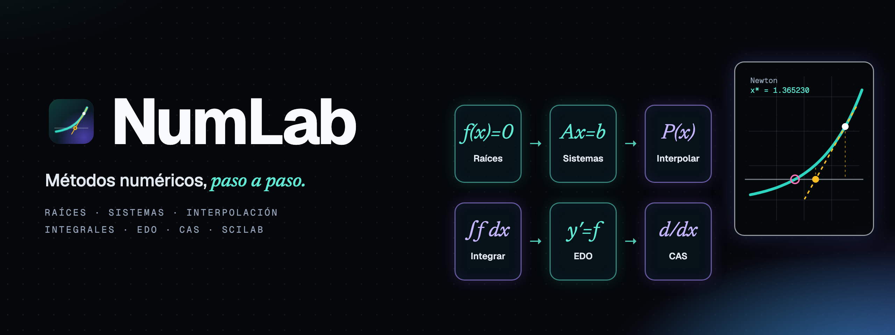
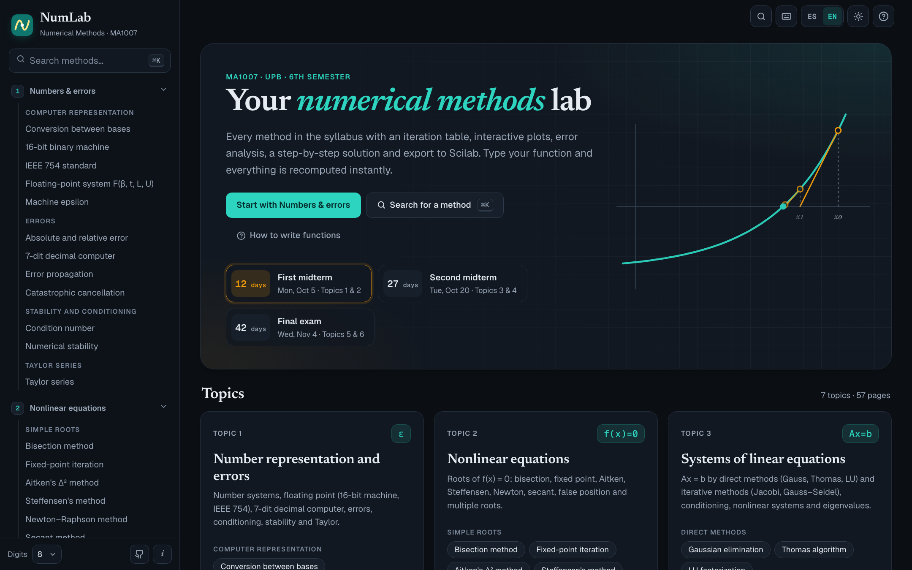
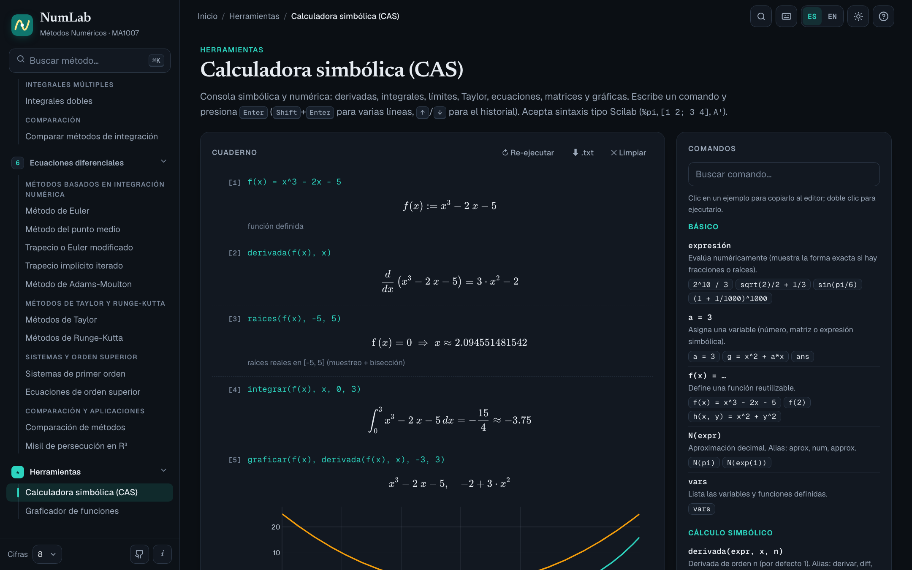
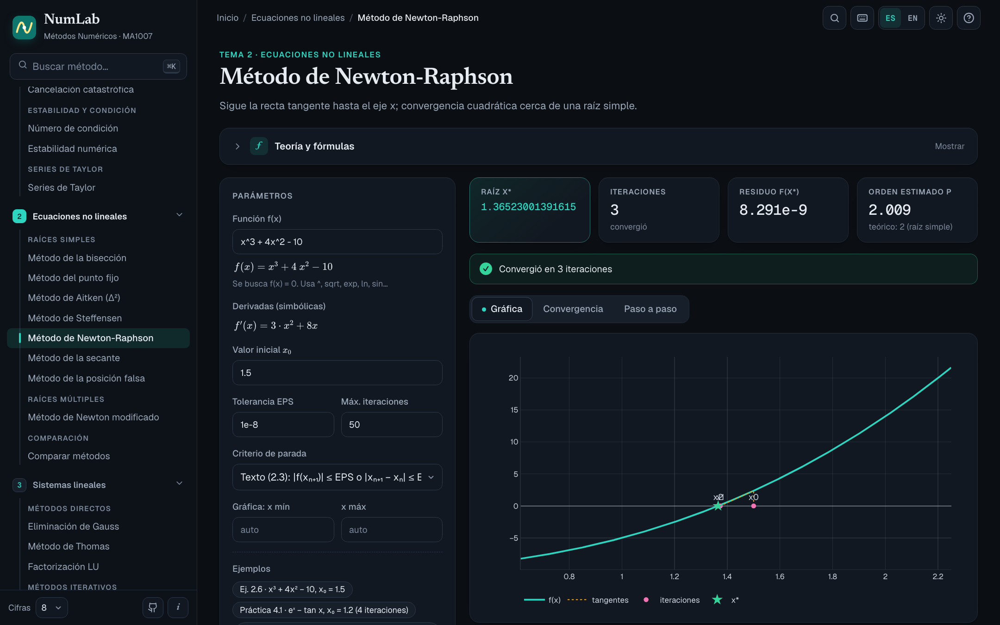
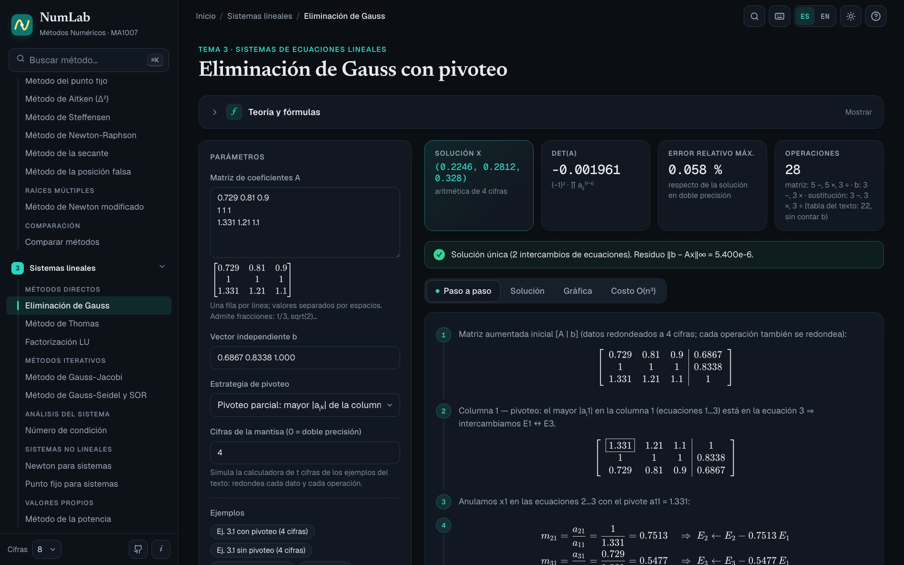
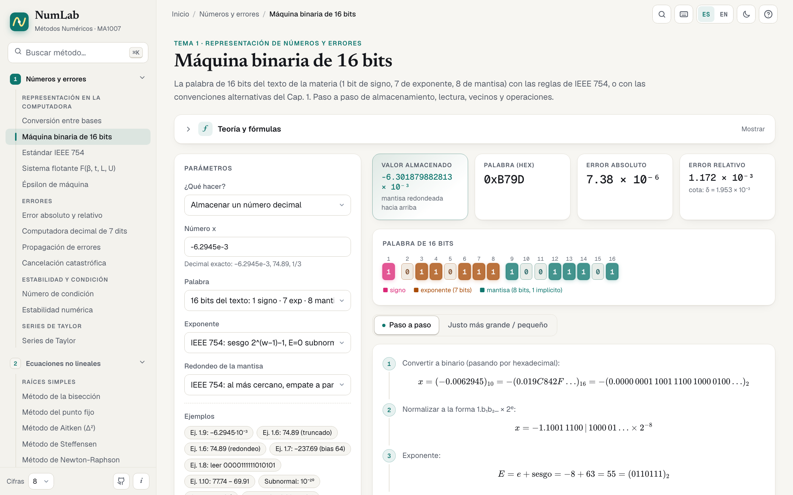
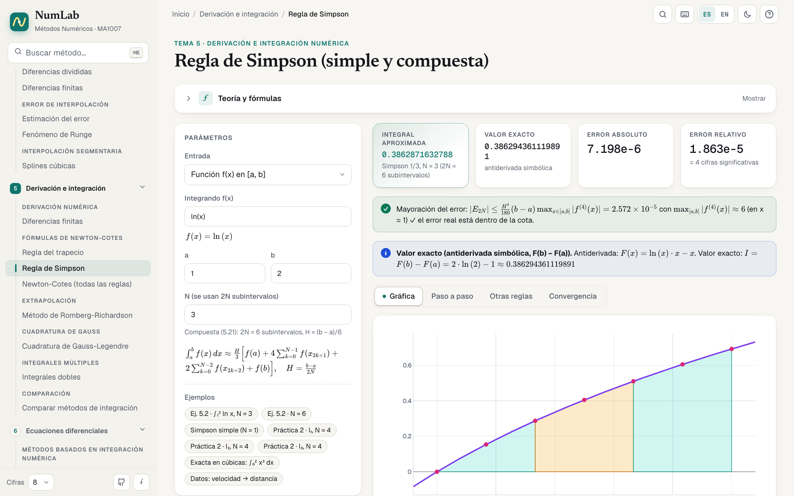
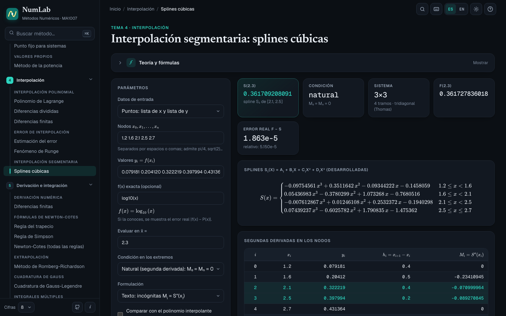
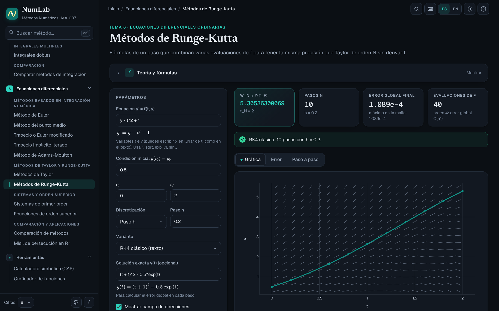
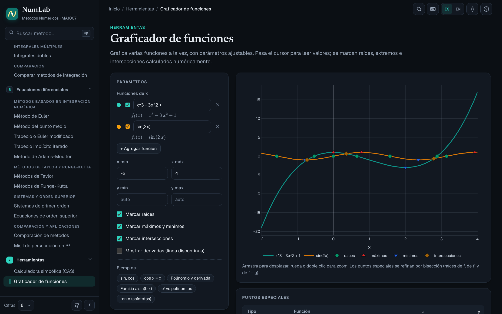

<p align="right"><a href="README.md">English</a> · <b>Español</b></p>

<p align="center">
  
</p>

<p align="center">
  <b>Escribes la función, eliges el método y NumLab te muestra cada iteración, la gráfica, el error<br>
  y el desarrollo paso a paso con los números sustituidos, tal como lo escribirías en el examen.<br>
  Y además, un CAS simbólico para todo lo demás.</b>
</p>

<p align="center">
  
  <a href="https://github.com/fernandevdaza/numlab/actions/workflows/ci.yml"></a>
  
  
  
  
  <br>
  
  
  
  
  <a href="LICENSE"></a>
</p>

<p align="center">
  <a href="https://fernandevdaza.github.io/numlab/"><b>🌐 Probar en el navegador</b></a> ·
  <a href="https://github.com/fernandevdaza/numlab/releases"><b>⬇️ Descargar para escritorio</b></a> ·
  <a href="#-desarrollo"><b>🛠️ Desarrollar</b></a>
</p>

<div align="center">

| **57 páginas** | **CAS simbólico** | **828 pruebas** | **3 plataformas** | **2 idiomas** |
|:---:|:---:|:---:|:---:|:---:|
| todo un curso de métodos numéricos | derivadas · integrales · límites · ecuaciones | contra los ejemplos del libro | macOS · Windows · Linux | español · inglés |

</div>

> **Funciona sin conexión, todo en tu equipo.** El cálculo ocurre en tu navegador o en la app de escritorio: no hay
> servidor, cuentas ni rastreo.

---

## ✨ Qué hace

- **Paso a paso de examen.** Cada método muestra las fórmulas en KaTeX con los valores sustituidos en las primeras
  iteraciones: multiplicadores de Gauss, bits de la mantisa, diferencias divididas, etapas de Runge-Kutta…
- **Un CAS de verdad.** Derivadas, primitivas e integrales definidas exactas, límites, series de Taylor,
  simplificación, factorización, fracciones parciales, ecuaciones y sistemas, y álgebra matricial. El mismo motor
  simbólico alimenta los métodos (derivadas exactas para Newton, coeficientes de Taylor exactos, integrales de
  referencia exactas).
- **Fiel al curso.** Notación, criterios de parada y variantes siguen el texto de la materia. Sus ejemplos resueltos
  están a un clic ("Ej. 2.8", "Ej. 4.12"…) y reproducen sus tablas cifra por cifra, incluida la calculadora de
  4 cifras cuando el ejemplo la usa.
- **Gráficas que no mienten.** El muestreo es adaptativo: no pierde picos ni oscilaciones, y corta las asíntotas y
  los saltos en lugar de dibujar líneas falsas.
- **Análisis de error y convergencia.** Orden estimado, cotas teóricas contra error real, cifras significativas y
  número de condición.
- **Exporta a Scilab.** Cada página genera un script `.sce` listo para ejecutar con tus datos; las tablas se exportan
  a CSV.
- **Cómodo:** teclado de símbolos, ayuda integrada (`?`), búsqueda instantánea (`⌘K` / `Ctrl+K`), tema claro y
  oscuro, diseño adaptado a celulares e interfaz en **español o inglés** (se detecta sola y se cambia cuando quieras).

## 🧮 El CAS

Una consola tipo cuaderno con resultados simbólicos exactos (en TeX) y un graficador que marca raíces, extremos,
raíces dobles e intersecciones.

| Categoría | Comandos |
|---|---|
| Cálculo | `derivada(f, x, n)` · `integrar(f, x)` · `integrar(f, x, a, b)` (también ±∞) · `limite(f, x, a)` · `taylor(f, x, x0, n)` · `sumatoria(f, k, a, b)` |
| Álgebra | `simplificar` · `expandir` · `factorizar` · `fracciones_parciales` · `resolver(ec, x)` · `resolver_sistema(ec1, ec2, …)` · `raices(f, a, b)` |
| Matrices | `A = [1 2; 3 4]` · `det` · `inv` · `A'` · `rref` · `lu` · `lusolve(A, b)` · `eig` · `cond` · `norm(A, p)` |
| Además | variables y funciones propias (`f(x) = x^3 - 2x - 5`), `N(expr)`, `graficar(f, g, a, b)`, sintaxis de Scilab (`%pi`, `[1 2; 3 4]`) |

Los nombres en inglés (`diff`, `integrate`, `solve`, `plot`…) también funcionan.

## 📸 Capturas

<table>
  <tr>
    <td width="50%"><p align="center"><sub><b>Inicio</b> · temas del sílabo y cuenta regresiva de exámenes</sub></p></td>
    <td width="50%"><p align="center"><sub><b>Calculadora simbólica (CAS)</b> · resultados exactos en TeX</sub></p></td>
  </tr>
  <tr>
    <td><p align="center"><sub><b>Newton-Raphson</b> · iteraciones, tangentes y orden de convergencia</sub></p></td>
    <td><p align="center"><sub><b>Eliminación de Gauss</b> · pivoteo y matriz aumentada paso a paso</sub></p></td>
  </tr>
  <tr>
    <td><p align="center"><sub><b>Máquina binaria de 16 bits</b> · signo, exponente y mantisa</sub></p></td>
    <td><p align="center"><sub><b>Regla de Simpson</b> · valor exacto simbólico y cota del error</sub></p></td>
  </tr>
  <tr>
    <td><p align="center"><sub><b>Splines cúbicas</b> · natural y forzada</sub></p></td>
    <td><p align="center"><sub><b>Runge-Kutta</b> · etapas, solución exacta y error global</sub></p></td>
  </tr>
  <tr>
    <td colspan="2"><p align="center"><sub><b>Graficador</b> · raíces, extremos e intersecciones</sub></p></td>
  </tr>
</table>

## 📚 Contenido

| Tema | Métodos |
|---|---|
| **1 · Representación de números y errores** | Conversión entre bases · Máquina binaria de 16 bits · Estándar IEEE 754 · Sistema flotante F(β, t, L, U) · Épsilon de máquina · Error absoluto y relativo · Computadora decimal de 7 dits · Propagación de errores · Cancelación catastrófica · Número de condición · Estabilidad numérica · Series de Taylor |
| **2 · Ecuaciones no lineales** | Bisección · Punto fijo · Aitken (Δ²) · Steffensen · Newton-Raphson · Secante · Posición falsa · Newton modificado (raíces múltiples) · Comparación |
| **3 · Sistemas de ecuaciones lineales** | Eliminación de Gauss · Thomas · Factorización LU · Gauss-Jacobi · Gauss-Seidel y SOR · Número de condición · Newton para sistemas · Punto fijo para sistemas · Método de la potencia |
| **4 · Interpolación** | Lagrange · Diferencias divididas · Diferencias finitas · Estimación del error · Fenómeno de Runge · Splines cúbicas |
| **5 · Derivación e integración numérica** | Diferencias finitas · Trapecio · Simpson · Newton-Cotes · Romberg-Richardson · Gauss-Legendre · Integrales dobles · Comparación |
| **6 · Ecuaciones diferenciales ordinarias** | Euler · Punto medio · Trapecio / Euler modificado · Trapecio implícito · Adams-Moulton · Taylor · Runge-Kutta · Sistemas de primer orden · Orden superior · Comparación · Misil de persecución en R³ |
| **Herramientas** | Calculadora simbólica (CAS) · Graficador de funciones |

## ⬇️ Descargar

Descarga el instalador para tu sistema desde **[Releases](https://github.com/fernandevdaza/numlab/releases)**:

| Sistema | Archivo |
|---|---|
| macOS (Apple Silicon e Intel) | `NumLab-x.y.z-mac-arm64.dmg` · `NumLab-x.y.z-mac-x64.dmg` |
| Windows | `NumLab-x.y.z-win-x64.exe` |
| Linux | `NumLab-x.y.z-linux-*.AppImage` · `NumLab-x.y.z-linux-*.deb` |

> [!NOTE]
> Las apps aún no están firmadas digitalmente.
> **macOS:** la primera vez abre la app con clic derecho → *Abrir* (o ejecuta `xattr -cr /Applications/NumLab.app`).
> **Windows:** si aparece SmartScreen, pulsa *Más información* → *Ejecutar de todas formas*.

¿Prefieres no instalar nada? Usa la **[versión web](https://fernandevdaza.github.io/numlab/)**: es la misma app.

## ✅ Verificación

La fidelidad es la prioridad del proyecto:

```bash
pnpm test
```

| Prueba | Qué comprueba |
|---|---|
| `test:metodos` | 828 comprobaciones que reproducen los ejemplos resueltos de los 6 capítulos del texto de la materia, tablas de Burden & Faires y formas cerradas. Si un libro trae un error aritmético, se usa el valor correcto y la prueba lo documenta. |
| `test:graficas` | Que la curva dibujada no se aleje de la función real: picos estrechos, oscilaciones, asíntotas y saltos. |
| `test:tex` | Que ninguna fórmula pierda barras invertidas dentro del código (`\;`, `\frac`…). |

## 🛠️ Desarrollo

Requisitos: [Node.js](https://nodejs.org) 22 o superior y [pnpm](https://pnpm.io).

```bash
pnpm install
pnpm dev            # versión web en http://localhost:5173
pnpm desktop        # compila y abre la app de escritorio (Electron)
pnpm dist           # genera el instalador para tu sistema en release/
pnpm capturas       # regenera el ícono, los banners y las capturas de docs/
```

```
src/
  modules/<tema>/     un módulo por tema: algoritmos puros, páginas, teoría e index.ts (registro)
  components/         interfaz compartida (MethodPage, DataTable, ScilabCode, Plot, ayuda, teclado…)
  lib/                expresiones (mathjs), formato de números, muestreo de gráficas
  i18n.ts             español/inglés: L('texto', 'text')
  config.ts           datos del curso (nombre, fechas de exámenes, repositorio)
electron/             proceso principal de la app de escritorio
scripts/              pruebas y generación de imágenes
.github/workflows/    CI, demo web (GitHub Pages) e instaladores de escritorio
```

**¿Lo quieres para tu curso?** Cambia los datos en [`src/config.ts`](src/config.ts). Si dejas vacías las fechas de
exámenes, la cuenta regresiva no se muestra.

**Publicar una versión:** sube una etiqueta `vX.Y.Z` (igual a `version` en `package.json`). GitHub Actions compila
los instaladores para las tres plataformas y los adjunta a un borrador de release.

## 🤝 Contribuir

¡Las contribuciones son bienvenidas! Reportes de errores numéricos, nuevos métodos, mejoras de interfaz o
traducciones. Lee [CONTRIBUTING.es.md](CONTRIBUTING.es.md).

## 📄 Licencia

[MIT](LICENSE) © 2026 Fernando Daza y colaboradores.

Hecho con [React](https://react.dev), [TypeScript](https://www.typescriptlang.org), [Vite](https://vite.dev),
[mathjs](https://mathjs.org), [nerdamer](https://nerdamer.com), [KaTeX](https://katex.org),
[Plotly](https://plotly.com/javascript/) y [Electron](https://www.electronjs.org).
