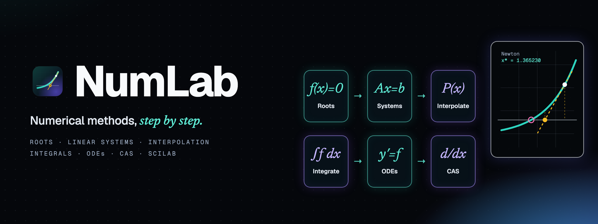
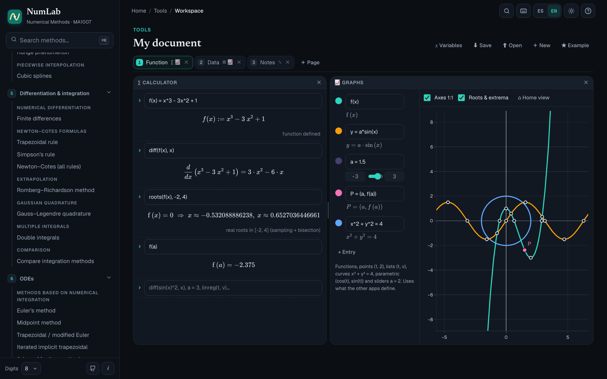
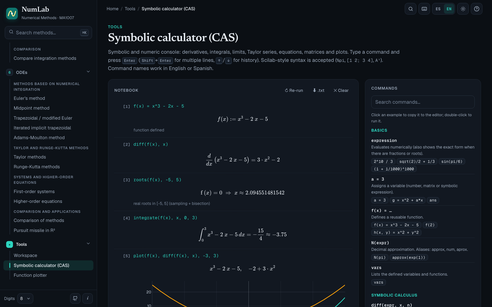
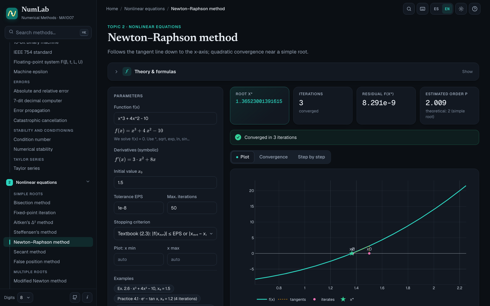
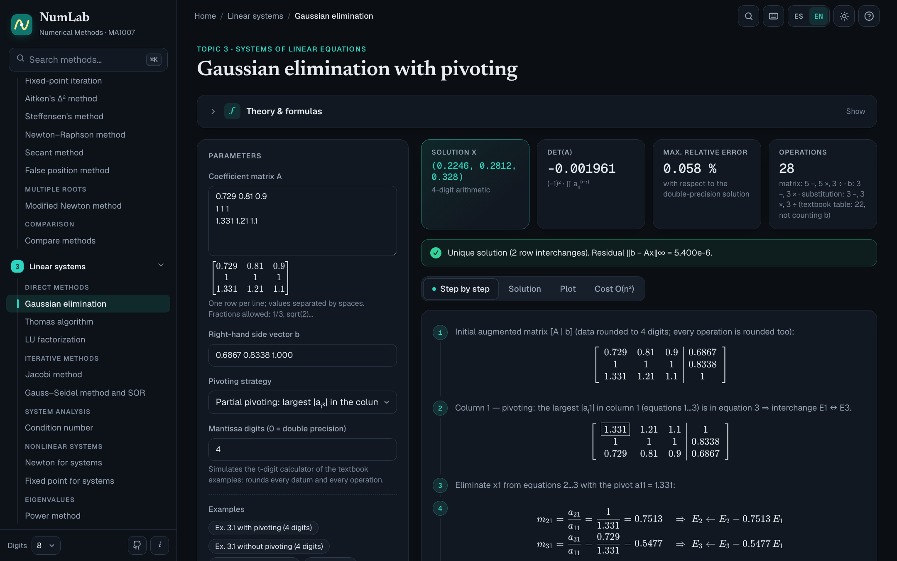
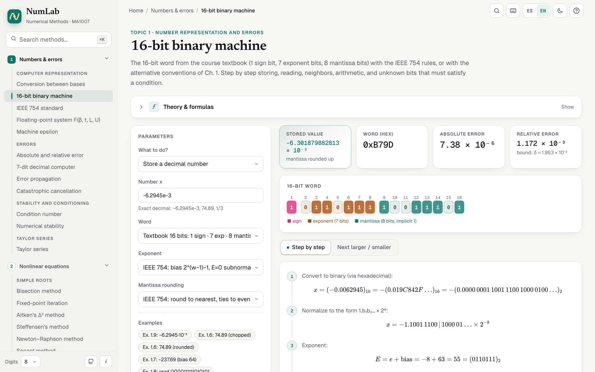
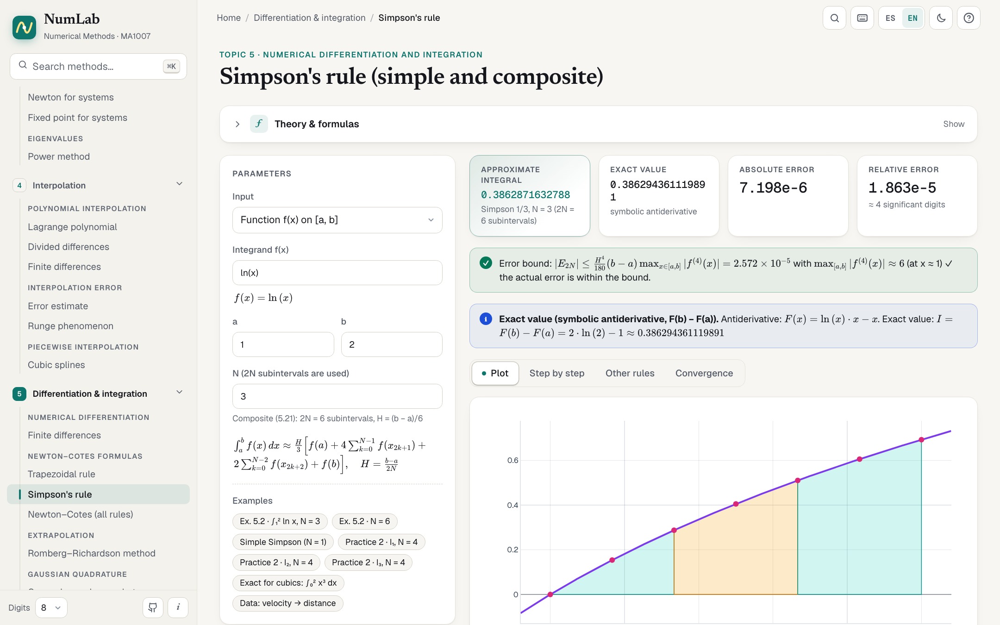
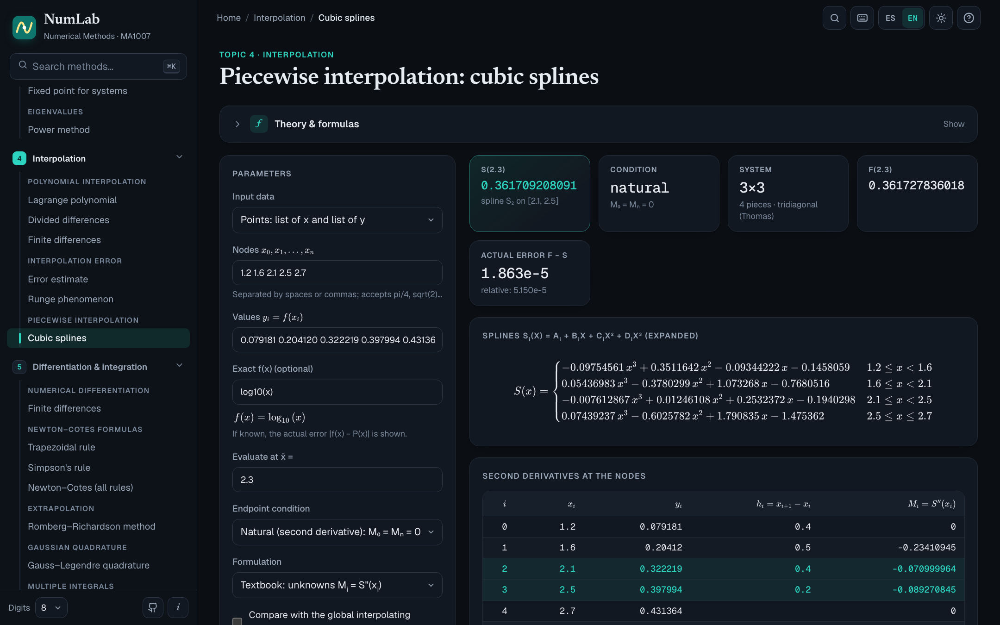
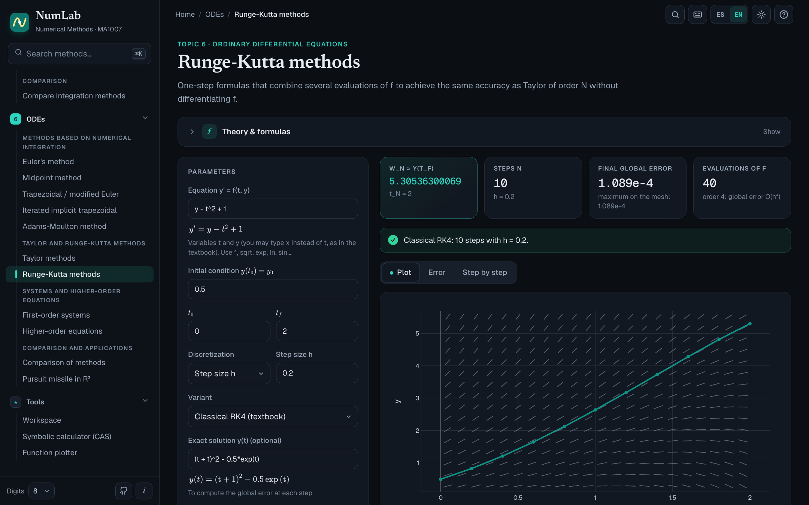
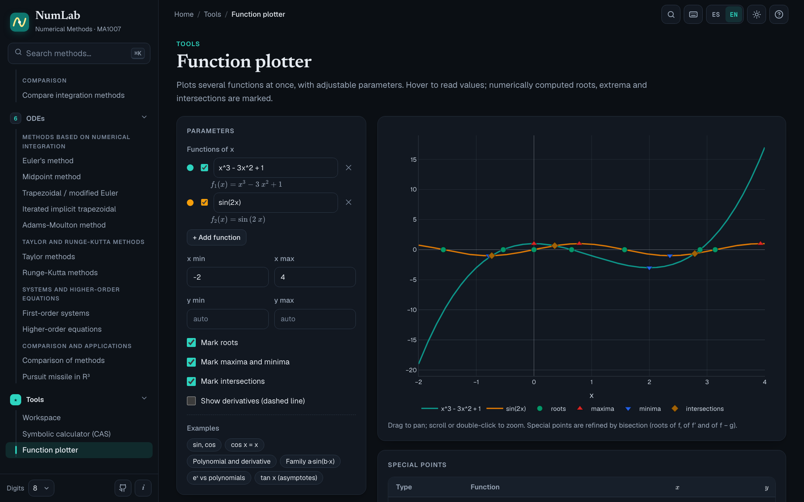

<p align="right"><b>English</b> · <a href="README.es.md">Español</a></p>

<p align="center">
  
</p>

<p align="center">
  <b>Type a function, pick a method, and NumLab shows every iteration, the plot, the error<br>
  and a step-by-step derivation with the numbers plugged in — exactly as you would write it on an exam.<br>
  Plus a symbolic CAS for everything in between.</b>
</p>

<p align="center">
  
  <a href="https://github.com/fernandevdaza/numlab/actions/workflows/ci.yml"></a>
  
  
  
  
  <br>
  
  
  
  
  <a href="LICENSE"></a>
</p>

<p align="center">
  <a href="https://fernandevdaza.github.io/numlab/"><b>🌐 Try it in your browser</b></a> ·
  <a href="https://github.com/fernandevdaza/numlab/releases"><b>⬇️ Download for desktop</b></a> ·
  <a href="#-development"><b>🛠️ Develop</b></a>
</p>

<div align="center">

| **58 pages** | **Symbolic CAS** | **876 tests** | **3 platforms** | **2 languages** |
|:---:|:---:|:---:|:---:|:---:|
| a full numerical methods course | derivatives · integrals · limits · solve | against textbook examples | macOS · Windows · Linux | English · Spanish |

</div>

> **Works offline, runs locally.** Every computation happens in your browser or in the desktop app: no server,
> no accounts, no tracking.

---

## ✨ Features

- **Exam-style step by step.** Every method renders its formulas with KaTeX and plugs the actual numbers into the
  first iterations: Gaussian elimination multipliers, mantissa bits, divided differences, Runge–Kutta stages…
- **A workspace like TI-Nspire or GeoGebra.** Pages with a calculator, graphs (sliders, points, implicit and
  parametric curves, pan and zoom), a spreadsheet (formulas, named columns as lists, `linreg`, paste from Excel)
  and notes with TeX — all sharing the same variables. Save and open documents as `.numlab.json`.
- **A real CAS inside.** Exact derivatives, antiderivatives and definite integrals, limits, Taylor series,
  simplification, factoring, partial fractions, equation and system solving, and matrix algebra — and the same
  symbolic engine powers the methods (exact Newton derivatives, exact Taylor coefficients, exact reference integrals).
- **Faithful to the course.** Notation, stopping criteria and method variants follow the course textbook; its worked
  examples are one click away ("Ex. 2.8", "Ex. 4.12"…) and reproduce its tables digit by digit — including the
  4-digit calculator when an example uses one.
- **Plots that don't lie.** Adaptive sampling never misses narrow peaks or oscillations, and it breaks the curve at
  asymptotes and jumps instead of drawing fake vertical lines.
- **Error and convergence analysis.** Estimated order of convergence, theoretical bounds vs. actual error,
  significant digits and condition numbers.
- **Scilab export.** Every page generates a ready-to-run `.sce` script with your data; tables export to CSV.
- **Pleasant to use.** Symbol keyboard, built-in help (`?`), instant search (`⌘K` / `Ctrl+K`), light and dark
  themes, mobile-friendly layout, and an **English/Spanish** interface (auto-detected, switch anytime).

## 🧮 The CAS

A notebook-style console with exact symbolic results (rendered in TeX), plus a function plotter that marks roots,
extrema, double roots and intersections.

| Category | Commands |
|---|---|
| Calculus | `diff(f, x, n)` · `integrate(f, x)` · `integrate(f, x, a, b)` (also ±∞) · `limit(f, x, a)` · `taylor(f, x, x0, n)` · `sum(f, k, a, b)` |
| Algebra | `simplify` · `expand` · `factor` · `partfrac` · `solve(eq, x)` · `solve_system(eq1, eq2, …)` · `roots(f, a, b)` |
| Matrices | `A = [1 2; 3 4]` · `det` · `inv` · `A'` · `rref` · `lu` · `lusolve(A, b)` · `eig` · `cond` · `norm(A, p)` |
| Everything else | variables and user functions (`f(x) = x^3 - 2x - 5`), `N(expr)`, `plot(f, g, a, b)`, Scilab syntax (`%pi`, `[1 2; 3 4]`) |

Spanish command names (`derivada`, `integrar`, `resolver`, `graficar`…) work too.

## 📸 Screenshots

<table>
  <tr>
    <td colspan="2"><p align="center"><sub><b>Workspace</b> · calculator, graphs, spreadsheet and notes sharing variables</sub></p></td>
  </tr>
  <tr>
    <td width="50%"><p align="center"><sub><b>Home</b> · course topics and exam countdown</sub></p></td>
    <td width="50%"><p align="center"><sub><b>Symbolic calculator (CAS)</b> · exact results in TeX</sub></p></td>
  </tr>
  <tr>
    <td><p align="center"><sub><b>Newton–Raphson</b> · iterations, tangents and order of convergence</sub></p></td>
    <td><p align="center"><sub><b>Gaussian elimination</b> · pivoting and the augmented matrix, step by step</sub></p></td>
  </tr>
  <tr>
    <td><p align="center"><sub><b>16-bit binary machine</b> · sign, exponent and mantissa</sub></p></td>
    <td><p align="center"><sub><b>Simpson's rule</b> · exact symbolic reference and error bound</sub></p></td>
  </tr>
  <tr>
    <td><p align="center"><sub><b>Cubic splines</b> · natural and clamped</sub></p></td>
    <td><p align="center"><sub><b>Runge–Kutta</b> · stages, exact solution and global error</sub></p></td>
  </tr>
  <tr>
    <td colspan="2"><p align="center"><sub><b>Function plotter</b> · roots, extrema and intersections</sub></p></td>
  </tr>
</table>

## 📚 Contents

| Topic | Methods |
|---|---|
| **1 · Number representation and errors** | Base conversion · 16-bit binary machine · IEEE 754 · Floating-point system F(β, t, L, U) · Machine epsilon · Absolute and relative error · 7-digit decimal machine · Error propagation · Catastrophic cancellation · Condition number · Numerical stability · Taylor series |
| **2 · Nonlinear equations** | Bisection · Fixed point · Aitken (Δ²) · Steffensen · Newton–Raphson · Secant · False position · Modified Newton (multiple roots) · Comparison |
| **3 · Systems of linear equations** | Gaussian elimination · Thomas algorithm · LU factorization · Jacobi · Gauss–Seidel and SOR · Condition number · Newton for systems · Fixed point for systems · Power method |
| **4 · Interpolation** | Lagrange · Divided differences · Finite differences · Error estimate · Runge phenomenon · Cubic splines |
| **5 · Numerical differentiation and integration** | Finite differences · Trapezoidal rule · Simpson's rule · Newton–Cotes · Romberg–Richardson · Gauss–Legendre · Double integrals · Comparison |
| **6 · Ordinary differential equations** | Euler · Midpoint · Trapezoidal / modified Euler · Implicit trapezoidal · Adams–Moulton · Taylor · Runge–Kutta · First-order systems · Higher-order equations · Comparison · Pursuit missile in R³ |
| **Tools** | Workspace (calculator, graphs, spreadsheet, notes) · Symbolic calculator (CAS) · Function plotter |

## ⬇️ Download

Get the installer for your system from **[Releases](https://github.com/fernandevdaza/numlab/releases)**:

| System | File |
|---|---|
| macOS (Apple Silicon and Intel) | `NumLab-x.y.z-mac-arm64.dmg` · `NumLab-x.y.z-mac-x64.dmg` |
| Windows | `NumLab-x.y.z-win-x64.exe` |
| Linux | `NumLab-x.y.z-linux-*.AppImage` · `NumLab-x.y.z-linux-*.deb` |

> [!NOTE]
> The apps are not code-signed yet.
> **macOS:** the first time, right-click the app → *Open* (or run `xattr -cr /Applications/NumLab.app`).
> **Windows:** if SmartScreen appears, click *More info* → *Run anyway*.

Don't want to install anything? The **[web version](https://fernandevdaza.github.io/numlab/)** is the same app.

## ✅ Verification

Correctness comes first:

```bash
pnpm test
```

| Test | What it checks |
|---|---|
| `test:metodos` | 876 assertions reproducing the worked examples of all six chapters of the course textbook, Burden & Faires tables and closed forms. When a book contains an arithmetic slip, the app uses the correct value and the test documents it. |
| `test:graficas` | That the plotted curve stays close to the true function: narrow peaks, oscillations, asymptotes and jumps. |
| `test:tex` | That no formula loses its backslashes inside the code (`\;`, `\frac`…). |

## 🛠️ Development

Requirements: [Node.js](https://nodejs.org) 22+ and [pnpm](https://pnpm.io).

```bash
pnpm install
pnpm dev            # web version at http://localhost:5173
pnpm desktop        # build and open the desktop app (Electron)
pnpm dist           # build the installer for your system into release/
pnpm capturas       # regenerate the icon, banners and screenshots in docs/
```

```
src/
  modules/<topic>/    one module per topic: pure algorithms, pages, theory and index.ts (registry)
  components/         shared UI (MethodPage, DataTable, ScilabCode, Plot, help, symbol keyboard…)
  lib/                expressions (mathjs), number formatting, plot sampling
  i18n.ts             English/Spanish: L('texto', 'text')
  config.ts           course data (name, exam dates, repository)
electron/             desktop app main process
scripts/              tests and image generation
.github/workflows/    CI, web demo (GitHub Pages) and desktop installers
```

**Using it for your own course?** Edit [`src/config.ts`](src/config.ts). Leave the exam dates empty to hide the
countdown.

**Releasing:** push a `vX.Y.Z` tag (matching `version` in `package.json`). GitHub Actions builds the installers for
all three platforms and attaches them to a draft release.

## 🤝 Contributing

Contributions are welcome: numerical bug reports, new methods, UI improvements and translations.
See [CONTRIBUTING.md](CONTRIBUTING.md).

## 📄 License

[MIT](LICENSE) © 2026 Fernando Daza and contributors.

Built with [React](https://react.dev), [TypeScript](https://www.typescriptlang.org), [Vite](https://vite.dev),
[mathjs](https://mathjs.org), [nerdamer](https://nerdamer.com), [KaTeX](https://katex.org),
[Plotly](https://plotly.com/javascript/) and [Electron](https://www.electronjs.org).
